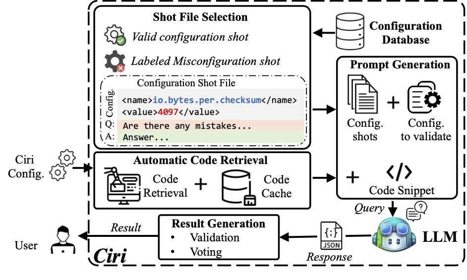

Artifact release for the paper "Large Language Models as Configuration Validators".

## Artifact organization

```
.
├── ciri/                   # Ciri engine
├── gallary/                # Gallary for the repository
├── icse25_data/            # Experiment data for paper reproduction
├── requirements.txt        # Python dependencies
├── LICENSE                 # License for the code
└── README.md               # README for the code
```

All the experiment data necessary to reproduce the figures and tables in the paper's evaluation section (Section 5) is included in `icse25_data`.

## Running Ciri 
### 📜 Overview
*Ciri* is an advanced LLM-driven configuration validation framework, and also serves as an open platform for future research.


### 🚨 Prerequisites
Please use python 3.9 or above.

GPT4 & GPT 3.5: Please follow the instruction from official [OpenAI website](https://help.openai.com/en/articles/5112595-best-practices-for-api-key-safety)  and [OpenAI API Keys](https://platform.openai.com/docs/quickstart?desktop-os=macOS) to set the API KEY.
The main step is `export OPENAI_API_KEY=your_api_key`.

Claude-3-Opus & Claude-3-Sonnet: Please follow the instruction from official [Claude AI website](https://docs.anthropic.com/claude/reference/client-sdks) and [Anthropic API Console](https://support.anthropic.com/en/collections/5370014-anthropic-api-api-console) to set the API KEY. 
The main step is `export ANTHROPIC_API_KEY=your_api_key`.

CodeLlama 7B/13B/34B & DeepSeek: Please make sure you have the computation resources to run the model.
### 🔥 Quick Start
```bash
git clone https://github.com/xlab-uiuc/ciri.git
cd ciri
pip install -r requirements.txt
```

Running an example:
```bash
python3 -m ciri.ciri_eng --input_path ciri/input/sample_input --output_path ciri/output/sample_output --model {model_name} --system hcommon --version 3.3.0
```
The output should be similar to:
```bash
[Ciri] Start
[Ciri] Running for file ciri/input/sample_input/hcommon_ex.xml
[Ciri] Result: There are 1 misconfiguration parameters in the input: fs.default.name
[Ciri] Reason for fs.default.name: The property 'fs.default.name' has the value 'file//' which does not follow the correct URI format.
[Ciri] Writing log file to ciri/output/sample_output/hcommon_ex.xml
[Ciri] End
```

### 🤔 Running Ciri with customized features 
<div align="left">

| Parameter                | Description                                        | Options                            |
|--------------------------|----------------------------------------------------|------------------------------------|
| input-path               | Directory or file path for the configuration files | ```directory or file path```       |
| output-path              | Directory where the output will be saved           | ```directory```                    | 
| model                    | LLM model to be queried                            | "Model Name" in Supported Models   |
| system                   | Name of the evaluated system                       | E.g., hcommon                      |
| version                  | Specific version of the system                     | E.g., 3.3.0                        |
| validconfig_shot_num     | Number of valid config shots to use                | E.g., 1                            |
| misconfig_shot_num       | Number of misconfig shots to use                   | E.g., 3                            |
| file_format              | Format of the config file                          | E.g., XML, INI                     |
| code-retrieval-path      | Path to the code repository                        | ```directory or file path```       |
| language                 | Project Programming Language                       | E.g., java                         |
| shot_system              | System name for sourcing alternate shot            | E.g., hcommon                      |
</div>

### 🚀 Supported Models

<div align="left">

| Models                | Status | Real Model Name                      |
|-----------------------|--------|--------------------------------------|
| GPT-4                 | ✅     | gpt-4-0125-preview                   |
| GPT-3.5               | ✅     | gpt-3.5-turbo-0125                   |
| Claude-3-Opus         | ✅     | claude-3-opus-20240229               |
| Claude-3-Sonnet       | ✅     | claude-3-sonnet-20240229             |
| CodeLlama 7B/13B/34B  | ✅     | CodeLLaMa-{7,13,34}b-Instruct-hf      |
| DeepSeek              | ✅     | deepseek-coder-6.7b-instruct         |

✅: Supported;  🔨: Coming soon;

</div>

### 📍 How to Port Ciri to a New Project
Ciri is designed as a flexible and extensible framework, allowing you to easily adapt it for new projects by providing the appropriate configuration data and model. To port Ciri to a new project, follow these steps:

1. Prepare the configuration shot files for the new project. These files should be placed in the `project_name` directory within `ciri/pre_processing/shot/shot_pool`. While shot files are optional—you can alternatively set the `shot_system` to reference an existing project—the inclusion of dedicated shot files is recommended for optimal performance.
2. If you plan to use the code retrieval feature, ensure that the code repository for the new project is properly prepared.
3. Run Ciri with the supplied configuration data and model.


## Experiment Reproduction
> [!IMPORTANT]
> Please note that remote models are frequently updated, which may impact their capabilities and results. For reproducibility, we have provided all raw results generated by the models along with reproduction scripts in the `icse25_data` directory.

### Effectiveness of Ciri (Table 5 & 6)
Ciri shows effectiveness of using state-of-the-art LLMs as configuration validators with the default setting, three misconfig shots and one validconfig shot.
For the project {`project`} and model {`model`}, you can run the script `result_parser.py` to reproduce the results listed in Finding 1 and Table 5.

```bash
python3 icse25_data/script/result_parser.py --project {project} --model {model} --mode default 
```

For example, if you want to get the results when running Ciri on project `hcommon` with model `gpt-4-0125-preview`, you can run the script:

```bash
python3 icse25_data/script/result_parser.py --project hcommon --model gpt-4-0125-preview --mode default 
```

For the real world misconfiguration (finding 2), please refer to the `icse25_data/results/real_world_misconfig` folder.

### Effectiveness of few-shot learning (Table 7 & 8, Figure 4)
Using configuration data as shots can effectively improve LLMs’ effectiveness of configuration validation. To further validate the effectiveness of Ciri without few-shot learning, we run Ciri on the same 10 projects with the same models without using any configuration data as shots.

For the project {`project`} and model {`model`}, you can run the script `result_parser.py` to reproduce the results.

```bash
python3 icse25_data/script/result_parser.py --project {project} --model {model} --mode zero_shot 
```

For example, if you want to get the results of the project `hcommon` and model `gpt-4-0125-preview`, you can run the script:

```bash
python3 icse25_data/script/result_parser.py --project hcommon --model gpt-4-0125-preview --mode zero_shot
```

To reproduce the results in Figure 4, you can run the script with the mode `shot-v{number of validconfig shots}m{number of misconfig shots}`.

To reproduce the results in Table 8, you can run the script with the mode `shot_from_{project that provides the shots}`.

### Bias (Figure 8 & 9) 
#### G-hits
Please refer to the document at the path `icse25_data/g_hits` which contains Google search result counts collected on August 6th, 2023.
For example, searching for "hadoop.common.configuration.version" returns a certain number of results. Note that these search result counts may have changed since the data was collected over a year ago, as Google's index is continuously updated.

To reproduce the results in Figure 8, you can run the script `get_figure8.py`.

```bash
python3 icse25_data/script/get_figure8.py
```

To reproduce the results in Figure 9, you can run the script `get_figure9.py`.

```bash
python3 icse25_data/script/get_figure9.py
```


